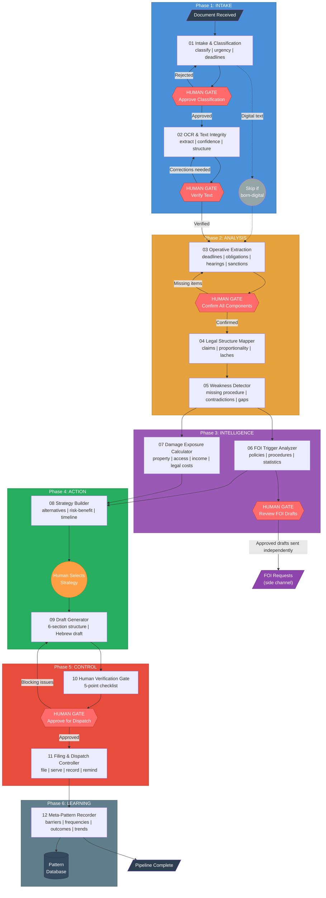
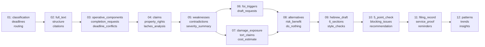

# Legal Document Processing Pipeline -- Flow Diagram

## Full Pipeline Flow



## Data Flow Between Agents



## Agent Dependency Matrix

Each agent receives cumulative context from prior stages. The matrix below shows which prior stage outputs each agent consumes directly.

```
Agent  | 01 | 02 | 03 | 04 | 05 | 06 | 07 | 08 | 09 | 10 | 11
-------|----|----|----|----|----|----|----|----|----|----|----
01     |    |    |    |    |    |    |    |    |    |    |
02     | x  |    |    |    |    |    |    |    |    |    |
03     | x  | x  |    |    |    |    |    |    |    |    |
04     | x  | x  | x  |    |    |    |    |    |    |    |
05     | x  | x  | x  | x  |    |    |    |    |    |    |
06     | x  | x  |    | x  | x  |    |    |    |    |    |
07     | x  |    | x  | x  | x  |    |    |    |    |    |
08     | x  |    | x  | x  | x  | x  | x  |    |    |    |
09     | x  | x  | x  | x  | x  |    | x  | x  |    |    |
10     | x  | x  | x  | x  | x  |    | x  | x  | x  |    |
11     | x  |    | x  |    |    |    |    |    | x  | x  |
12     | x  |    | x  | x  | x  |    | x  | x  |    |    | x
```

## Human Gates Summary

| Gate | Agent | Action Required | On Rejection | Blocking |
|------|-------|-----------------|--------------|----------|
| G01 | 01 - Intake | Approve classification, urgency, deadlines | Re-classify | Yes |
| G02 | 02 - OCR | Verify text accuracy, correct uncertain regions | Re-OCR | Yes |
| G03 | 03 - Operative | Confirm all components captured, add missed items | Re-extract | Yes |
| G06 | 06 - FOI | Review each FOI draft, approve/modify/reject individually | Revise drafts | No (side channel) |
| -- | 08 - Strategy | Human selects strategy from alternatives | N/A | Yes (selection required) |
| G10 | 10 - Verification | 5-point check: facts, law, dates, consistency, risk | Revise draft (back to 09) | Yes |

## Key Invariants

1. **No dispatch without human approval**: Agent 11 will not execute without Agent 10 `human_approved: true`.
2. **No FOI auto-send**: Agent 06 drafts only. Human decides which, if any, to send.
3. **No aggressive language**: Agent 09 runs style checks. Failures require revision.
4. **No personal attribution**: All critique targets decisions, not decision-makers.
5. **No pattern data on individuals**: Agent 12 records institutional patterns only.
6. **All estimates state assumptions**: Agent 07 damage figures include confidence levels and assumption lists.
7. **Append-only pattern store**: Agent 12 never deletes historical data.
