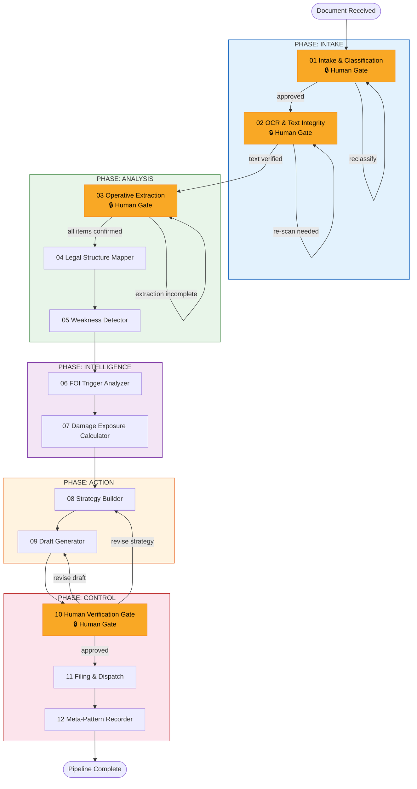

# Solvulator: 12-Agent Legal Document Processing Pipeline

## 1. Pipeline Flowchart



## 2. Agent Summary

| # | Agent | Role | Human Gate | Gemini |
|---|-------|------|:----------:|:------:|
| 01 | Intake & Classification | Source, type, urgency, deadlines | Yes | Yes |
| 02 | OCR & Text Integrity | Digitize, clean text, flag unclear areas | Yes | Yes |
| 03 | Operative Extraction | Deadlines, amounts, filings, hearings, sanctions | Yes | Yes |
| 04 | Legal Structure Mapper | Threshold/jurisdiction/proportionality/factual/procedural claims | No | Yes |
| 05 | Weakness Detector | Missing evidence, contradictions, procedural defects | No | Yes |
| 06 | FOI Trigger Analyzer | Draft FOI requests for referenced policies/procedures | No | Yes |
| 07 | Damage Exposure Calculator | Property, access, depreciation, income, legal costs | No | Yes |
| 08 | Strategy Builder | Risk/benefit table of response options | No | Yes |
| 09 | Draft Generator | Structured legal draft (6-section format) | No | Yes |
| 10 | Human Verification Gate | Facts, law refs, deadlines, consistency, risk check | Yes | No |
| 11 | Filing & Dispatch | Send, record proof, create reminders | No | No |
| 12 | Meta-Pattern Recorder | Barrier types, authority types, frequencies, outcomes | No | No |

## 3. Inter-Agent Data Cascade

```mermaid
flowchart LR
    D01["01: classification\n(source, type, urgency)"]
    D02["02: + clean_text\n+ sections\n+ unclear_regions"]
    D03["03: + operative_items\n(deadlines, amounts, filings)"]
    D04["04: + legal_structure\n+ authority_check"]
    D05["05: + weaknesses"]
    D06["06: + foi_triggers\n+ draft_requests"]
    D07["07: + damage_assessment\n+ exposure_summary"]
    D08["08: + strategy_options\n+ recommended_combination"]
    D09["09: + draft\n+ tone_check"]
    D10["10: + verification\n(5 checks, pass/fail)"]
    D11["11: + dispatch\n+ reminders"]
    D12["12: + patterns\n+ intelligence_notes\n+ pipeline_summary"]

    D01 --> D02 --> D03 --> D04 --> D05 --> D06 --> D07 --> D08 --> D09 --> D10 --> D11 --> D12
```



Each agent accumulates — output grows as the pipeline progresses. All payloads are JSON, wrapped in an envelope:

```json
{
  "run_id": "uuid",
  "pipeline_version": "1.0.0",
  "from_agent": "05",
  "to_agent": "06",
  "ts": "ISO8601",
  "status": "ok | error | pending_human",
  "payload": { }
}
```

## 4. solvulator.com Integration

### Web UI

```
Upload ──→ Pipeline Status Board ──→ Human Gate View ──→ Output
  │              │                         │                │
  │  all active  │  per-run: which agent,  │  approve or    │  download
  │  runs        │  payload, timestamps    │  reject+notes  │  final draft
```

Server-rendered HTML + htmx for updates. No SPA framework.

- `/` — active pipeline runs
- `/run/:id` — full run detail, agent-by-agent log
- `/gate/:run_id/:agent` — human approval form
- `/upload` — document upload

### API Endpoints

| Method | Path | Purpose |
|--------|------|---------|
| `POST` | `/api/document` | Upload document, start pipeline |
| `GET` | `/api/document/:id` | Document + pipeline status |
| `POST` | `/api/document/:id/approve` | Human gate approval |
| `POST` | `/api/document/:id/reject` | Human gate rejection → loops back |
| `GET` | `/api/pipeline/:id` | Full pipeline state |
| `GET` | `/api/pipeline/:id/output` | Download final draft |
| `GET` | `/api/patterns` | Query pattern database |
| `GET` | `/api/reminders` | Upcoming deadlines |

### Storage (SQLite)

```sql
CREATE TABLE documents (
  id TEXT PRIMARY KEY,
  file_path TEXT NOT NULL,
  source TEXT NOT NULL,
  document_type TEXT NOT NULL,
  date_received TEXT NOT NULL,
  associated_proceeding TEXT,
  created_at TEXT DEFAULT (datetime('now'))
);

CREATE TABLE pipeline_runs (
  id TEXT PRIMARY KEY,
  document_id TEXT REFERENCES documents(id),
  current_stage INTEGER DEFAULT 1,
  status TEXT DEFAULT 'active',
  started_at TEXT DEFAULT (datetime('now')),
  completed_at TEXT
);

CREATE TABLE stage_outputs (
  id TEXT PRIMARY KEY,
  pipeline_run_id TEXT REFERENCES pipeline_runs(id),
  agent_number INTEGER NOT NULL,
  input_json TEXT,
  output_json TEXT,
  status TEXT DEFAULT 'pending',
  human_approved INTEGER,
  created_at TEXT DEFAULT (datetime('now')),
  completed_at TEXT
);

CREATE TABLE patterns (
  id TEXT PRIMARY KEY,
  dimension TEXT NOT NULL,
  category TEXT,
  subcategory TEXT,
  value TEXT,
  tags TEXT,
  document_id TEXT REFERENCES documents(id),
  created_at TEXT DEFAULT (datetime('now'))
);

CREATE TABLE reminders (
  id TEXT PRIMARY KEY,
  document_id TEXT REFERENCES documents(id),
  type TEXT NOT NULL,
  due_date TEXT NOT NULL,
  description TEXT,
  completed INTEGER DEFAULT 0,
  created_at TEXT DEFAULT (datetime('now'))
);
```

## 5. Deployment — Minimal Viable Stack

```
bb (babashka) single process
├── http-kit server (random high port)
├── SQLite via pod-babashka-sqlite3
├── Gemini API (gemini-2.0-flash for intake, gemini-2.0-pro for reasoning)
├── File storage (./docs/)
└── HTML views (hiccup templates)
```

### File Layout

```
solvulator/
├── bb.edn
├── config.edn
├── src/
│   ├── server.clj
│   ├── pipeline.clj
│   ├── agents/
│   │   ├── a01_intake.clj .. a12_pattern.clj
│   ├── gemini.clj
│   ├── db.clj
│   └── views.clj
├── prompts/          # → grafanadesk/agents/*.md
├── docs/             # uploaded documents (gitignored)
├── solvulator.db     # SQLite (gitignored)
└── run.sh
```

### Run

```bash
export GEMINI_API_KEY=...
bb --classpath src -m server
```

### Principles

- One process. No microservices.
- Text streams. Every agent I/O is JSON.
- Composable parts. Each agent is `(fn [db run-id prev-payload] -> next-payload)`.
- Human gates are just state (`status: "pending_human"` → HTTP approval → re-enter loop).
- No ORM. Schema is 5 CREATE TABLE statements, run on startup.
